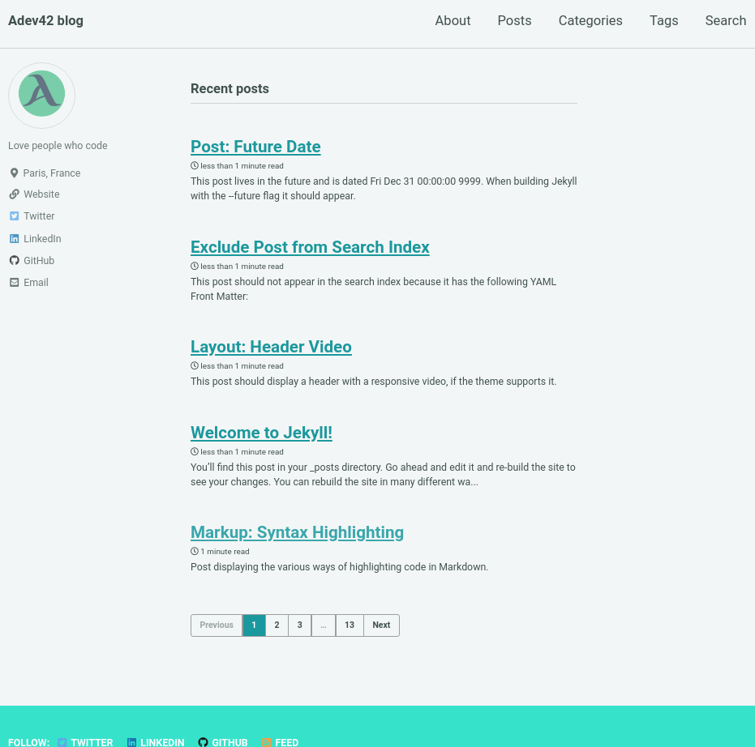
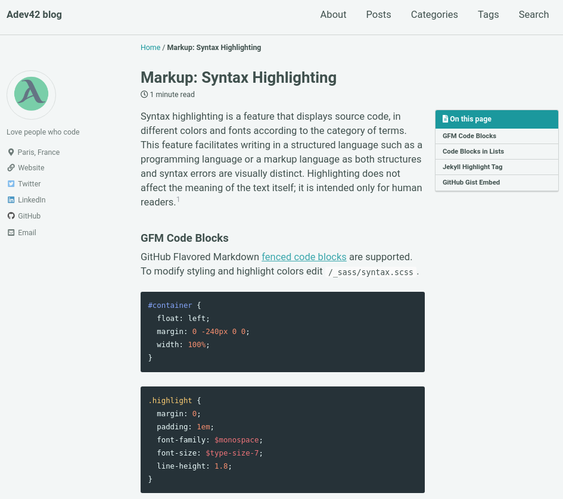

# Demo Jekyll with mmistakes theme

This is a demo static site generator using Jekyll and mmistakes theme.

Demo online at [https://github.com/geeky-bawa/demo-jekyll-mmistakes/](https://github.com/geeky-bawa/demo-jekyll-mmistakes/)

My Medium post: [https://medium.com/geeky-bawa/build-your-own-blog-website-without-spending-any-money-99053aaa1d58](https://medium.com/geeky-bawa/build-your-own-blog-website-without-spending-any-money-99053aaa1d58)

## How to use

- Clone this repo with `git clone`
- Go to the repo directory: `cd demo-jekyll-mmistakes`
- Install the gem dependencies with `bundle install`
- Run server `bundle exec jekyll server`

## Reference

- Jekyll website: [jekyllrb.com](https://jekyllrb.com/)
- Minimal mistakes theme [source mmistakes jekyll](https://github.com/mmistakes)
- Minimal mistakes guide [minimal-mistakes guide](https://mmistakes.github.io/minimal-mistakes/docs/quick-start-guide/)

## Demo home page

